# Matrix panel

The Matrix panel plugin provides simplified functionality of matrix control in a paginated report (Microsoft Report Builder).

Use the Matrix panel plugin to display grouped data and summary information similar to crosstabs and pivot tables. You can group data in row and column groups, add totals for summary information and format datetime values. Change the options and observe result immediately.

See the following examples:

**Sales grouped by Date-Region-City and Category-Product**

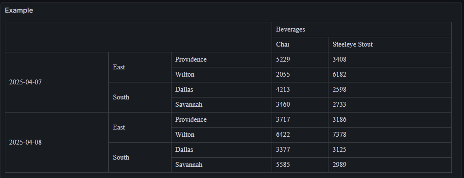

**The same with totals**

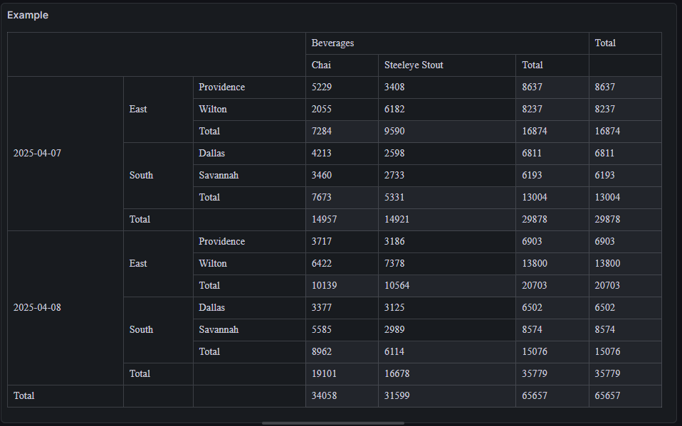

## Options

### RowGroups

Choose at least one field to group rows on. The order of fields is important.

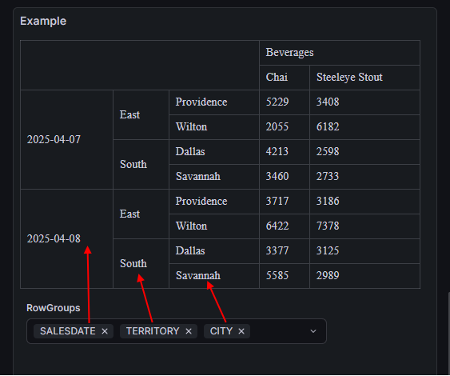

### ColumnGroups

Choose at least one field to group columns on. The order of fields is important.

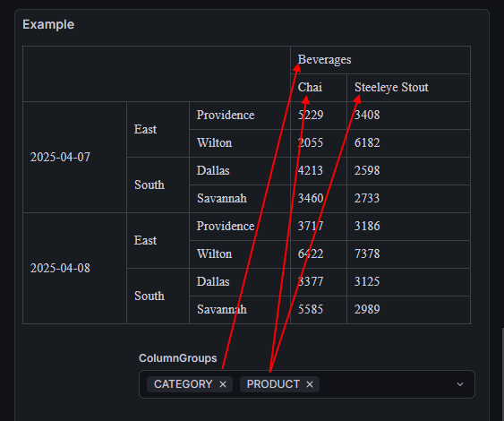

### DataField

Choose the data field to aggregate data on. The field must be of number type, otherwise there will be the appropriate warning. You can use Query inspector to check field types in your data.

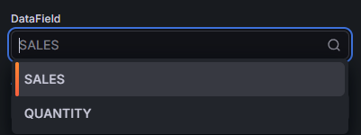

### AggregateFunction

Choose the aggregate function for the data field. The possible options are - **Sum**, **Max**, **Min**, **Avg**, **Count**.

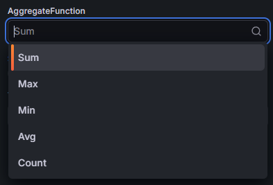

### ShowTotals

Show or hide summary information in totals.

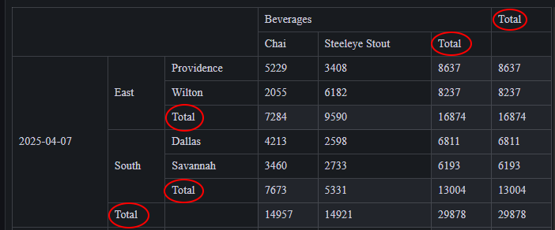

### TimeUnit

Format the datetime values if needed. It uses grafana's format and **must** starts with 'time:'. Examples are 'time:YYYY-MM-DD', 'time:YYYY-MM-DD HH:mm:ss'.
It applicable only for fields of datetime type, make sure appropriate field/fields is/are not of string type. You can use Query inspector for that and add 'Convert field type' transformation if needed.

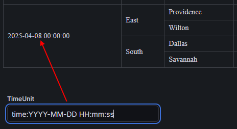

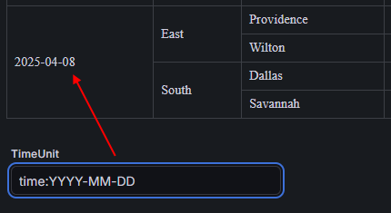

### Warnings

There are several checks for options and data. There are the possible warning messages.

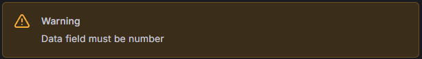

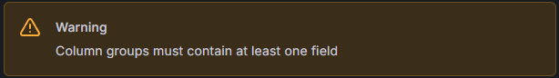

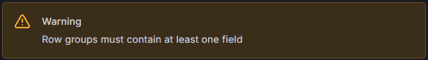

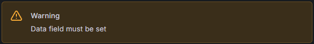

## Contributing

Author : Vasiliy Stepchenko\
E-Mail : <st.vasiliy1983@gmail.com>